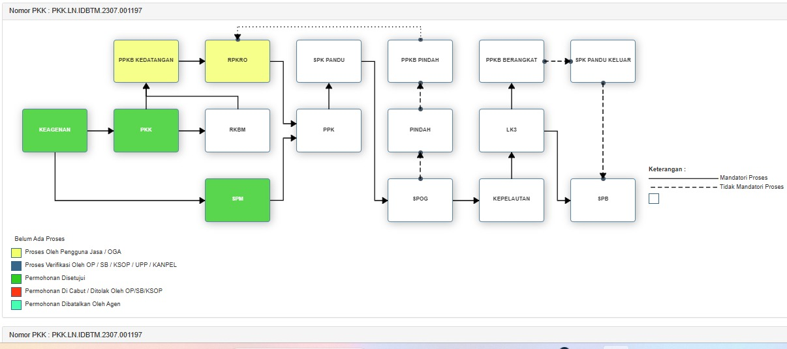
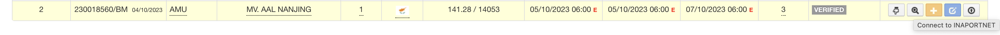

# Data Hold ke WSBP Server

Sering lakukan cek data `Hold` Agent / PBM pada [Log Email](log-email.md), pastikan data `Hold` sudah berhasil dikirim oleh `CMS` sekaligus berhasil diproses oleh `WSBP Server`, karena jika tidak melakukan pengecekan akan mengakibatkan `Rencana Penambatan Kapal dan Rencana Operasi (RPKRO)` atau `Rencana Kegiatan Bongkar Muat (RKBM)` terhadap pihak Agent / PBM terganggu.

## Integrasi Inaportnet

Jika ada kasus dimana data `Hold` (Agent / PBM) belum terkirim ke `WSBP Server` dan data belum terintegrasi dengan `Inaportnet`, bisa dipastikan karena kustomer (Agent / PBM) menggunakan `Bank BNI` pada `CMS`, sehingga terkadang data `Response Hold` yang diterima oleh `CMS` dari `Bank BNI` terjadi keterlambatan atau tidak bisa terbaca.

Untuk memastikan data `Hold` pada `CMS` sudah terintegrasi dengan `Inaportnet` bisa dicek melalu situs [Monitoring Inaportnet](https://monitoring-inaportnet.dephub.go.id), pada situs tersebut bisa dilanjutkan untuk melakukan input `No. Penetapan Penyandaran Kapal (PKK)` kemudian **enter**, setelah itu akan keluar beberapa data detail Kapal dan ada data alur proses seperti contoh dibawah ini :

Dari contoh data alur proses diatas yang perlu diperhatikan :

- `Permintaan Pelayanan Kapal dan Barang (PPKB)` harus berwarna `Hijau`.
- `Rencana Penambatan Kapal dan Rencana Operasi (RPKRO)` harus berwarna `Hijau`.
- `Rencana Kegiatan Bongkar Muat (RKBM)` harus berwarna `Hijau`.

Jika salah satu diatas masih bewarna `Putih` atau `Kuning` artinya data `Hold` (Agent / PBM) pada `CMS` masih belum terintegrasi dengan `Inaportnet`, maka lakukan proses pengiriman data secara [Manual](data-hold-wsbp.md#pengiriman-data-manual).

## Pengiriman Data (Otomatis)

Perlu diketahui bahwa Pengiriman Data `Hold` ke `WSBP Server` pada `CMS` adalah menggunakan metode [Cron Job](cronjob.md), dengan job waktu interval /10 menit.

## Pengiriman Data (Manual)

Untuk melakukan pengiriman data `Hold` (Agent / PBM) ke `WSBP Server` secara manual bisa dilakukan dengan cara masuk ke aplikasi `CMS` kemudian pergi ke menu [CMS Uper List](https://cms.scnport.com/uper.html), setelah itu tentukan data mana yang akan dikirim ulang dan dilanjutkan dengan menekan tombol `Connet To Inaportnet` seperti contoh gambar dibawah ini:

Setelah melakukan pengiriman data `Hold` dengan metode manual diatas, tunggu beberapa saat kemudian bisa dicek kembali ke situs [Monitoring Inaportnet](https://monitoring-inaportnet.dephub.go.id) apakah sudah terintegrasi datanya.
