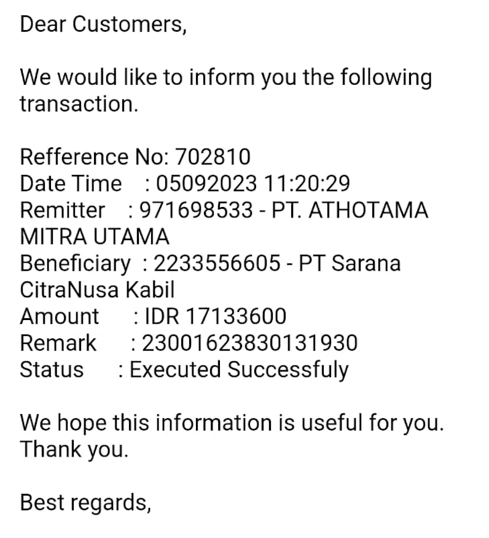
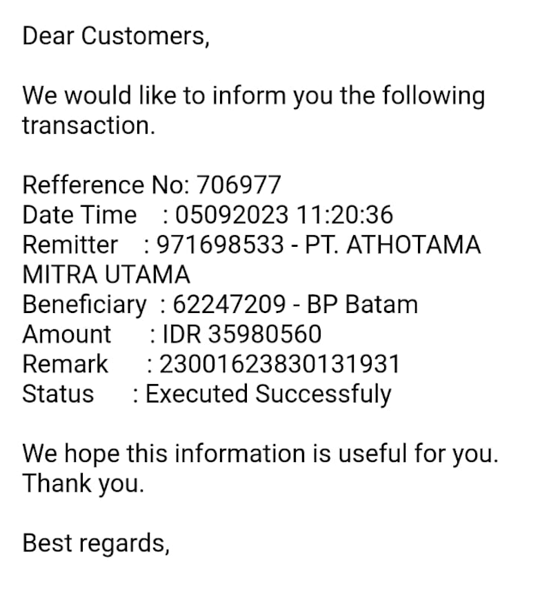
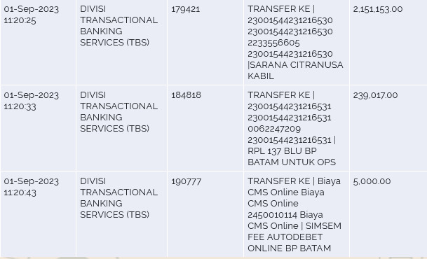
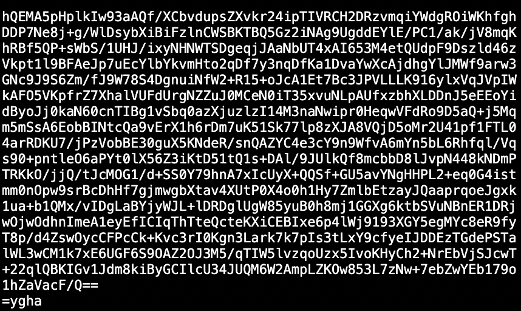
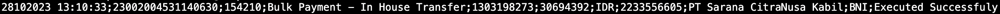
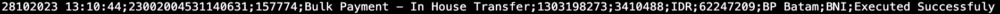

# Payment Bank BNI

Pada saat verifikator ke 2 (Port Manager / Satker) melakukan verifikasi maka Sistem `CMS` akan melakukan pengiriman Request `Release Hold` & `Auto Debit` ke `Bank BNI`.

Saat ini ada beberapa masalah pada `CMS` ketika Agent / PBM sukses melakukan `Payment / Auto Debit` menggunakan `BNI`, antara lain :

- File balikan tidak ada di direktori `incoming`, host `BNI` tidak mengirim balikan atau `CMS` tidak menerima file balikan.
- File balikan ada di direktori `incoming`, akan tetapi isi dari file balikan tidak sesuai [Format Standar](payment-bni.md#format-standar-file-balikan-bni).
- E-mail notifikasi tidak diterima oleh Agent / PBM dikarenakan E-mail sudah tidak aktif atau ada sebab yang lain.

## Update Status Paid (Manual)

Dengan adanya beberapa masalah diatas menyebabkan `CMS` tidak bisa mengubah data secara otomatis, ini bisa dilihat pada menu [Payment List](https://cms.scnport.com/payment.html) kemudian perhatikan dibagian kolom `Status` = `Verified Final` yang seharusnya adalah `Paid`, dan jika ditekan tombol `Show/Hide UPER Detil` pada list transaksi terkait maka akan terlihat data Agent / PBM yang bermasalah, perhatikan pada kolom `Status` = `Waiting Payment` yang seharusnya adalah `Paid`.

Maka disini harus dilakukan update data secara manual dengan cara-cara sebagai berikut :

### E-mail Dari Agent / PBM

#### Step 1

Hubungi `Team Port` untuk meminta screenshot notifikasi E-mail `BNI` ke pihak Agent / PBM, jika tidak ada notifikasi E-mail yang diterima maka bisa dilanjutkan dengan menggunakan cara [Mutasi Rekening Dari Agent / PBM](payment-bni.md#mutasi-rekening-dari-agent--pbm).

#### Step 2

Jika `Team Port` sudah mendapatkan screenshot notifikasi E-mail dari Agent / PBM, maka pasti ada dua screenshot yang diterima oleh `Team Port` dari pihak Agent / PBM terkait, jika `Team Port` hanya menerima satu screenshot maka komunikasikan kembali ke pihak Agent / PBM untuk meminta screenshot satunya lagi, karena notifikasi E-mail `Payment / Auto Debit` selalu ada dua atau berpasangan satu sama lain, untuk penjelasan data lebih detailnya sebagai berikut :

- Data `Beneficiary` yang pertama untuk No. Rekening `PT. Sarana Citranusa Kabil` dan yang kedua untuk No. Rekening `BP Batam`.
- Data `Remitter` dua-duanya sama.
- 12 digit awal dari data `Remark` dua-duanya sama, sesuai dengan gabungan data `No. PUK` dan `3 digit unik request payment`.
- Data `Status` dua-duanya sama yaitu `Executed Successfuly`.

Untuk contoh data screenshot notifikasi E-mail yang sesuai adalah sebagai berikut :




#### Step 3

Jika sudah dipastikan data screenshot notifikasi E-mail sesuai, maka tahap selanjutnya adalah menjalankan SQL Query dibawah ini :

```SQL
UPDATE uper_detail
    SET status = 'PAID',
        journalsequence = '#JOURNAL_SEQUENCE#'
WHERE code = '#CODE#'
```

!> ubah format `#JOURNAL_SEQUENCE#` dengan data gabungan `Refference No` antara `PT. Sarana Citranusa Kabil` dan `BP Batam` dengan dipisahkan dengan tanda `-`, pada contoh kasus ini jika melihat notifikasi E-mail diatas adalah `702810-706977`.

!> ubah format `#CODE#` dengan data 12 digit awal dari data `Remark`, pada contoh kasus ini jika melihat notifikasi E-mail diatas adalah `230016238301`.

Hasil perubahan format SQL Query pada contoh kasus ini adalah :

```SQL
UPDATE uper_detail
    SET status = 'PAID',
        journalsequence = '702810-706977'
WHERE code = '230016238301'
```

Jika SQL Query diatas sukses dijalankan maka pada tampilan [Payment List](https://cms.scnport.com/payment.html) jika ditekan tombol `Show/Hide UPER Detil` pada list transaksi terkait akan terlihat data detail Agent / PBM, kemudian perhatikan pada kolom `Status` yang sebelumnya adalah `Waiting Payment` akan berubah menjadi `Paid`.

#### Step 4

Selesai.

### Mutasi Rekening Dari Agent / PBM

#### Step 1

Hubungi `Team Port` untuk meminta data screenshot Mutasi Rekening dari transaksi terkait ke pihak Agent / PBM.

#### Step 2

Jika `Team Port` sudah mendapatkan screenshot Mutasi Rekening dari Agent / PBM, maka perlu diperhatikan beberapa data detailnya sebagai berikut :

- 12 digit awal dari data `Kolom ketiga` setelah tanda `|` yang pertama dua-duanya sama, sesuai dengan gabungan data `No. PUK` dan `3 digit unik request payment`.
- Data terakhir dari `Kolom ketiga` setelah tanda `|` yang kedua adalah `Sarana Citranusa Kabil` dan `RPL 137 BLU BP BATAM`.

Untuk contoh data screenshot Mutasi Rekening yang sesuai adalah sebagai berikut :



#### Step 3

Jika sudah dipastikan data screenshot Mutasi Rekening sesuai, maka tahap selanjutnya adalah menjalankan SQL Query dibawah ini :

```SQL
UPDATE uper_detail
    SET status = 'PAID',
        journalsequence = '#JOURNAL_SEQUENCE#'
WHERE code = '#CODE#'
```

!> ubah format `#JOURNAL_SEQUENCE#` dengan data gabungan dari masing-masing `Kolom kedua` antara `Sarana Citranusa Kabil` dan `RPL 137 BLU BP Batam` dengan dipisahkan dengan tanda `-`, pada contoh kasus ini jika melihat Mutasi Rekening diatas adalah `179421-184818`.

!> ubah format `#CODE#` dengan data 12 digit awal dari data `Kolom ketiga` setelah tanda `|` yang pertama, pada contoh kasus ini jika melihat Mutasi Rekening diatas adalah `230015442312`.

Hasil perubahan format SQL Query pada contoh kasus ini adalah :

```SQL
UPDATE uper_detail
    SET status = 'PAID',
        journalsequence = '179421-184818'
WHERE code = '230015442312'
```

Jika SQL Query diatas sukses dijalankan maka pada tampilan [Payment List](https://cms.scnport.com/payment.html) jika ditekan tombol `Show/Hide UPER Detil` pada list transaksi terkait akan terlihat data detail Agent / PBM, kemudian perhatikan pada kolom `Status` yang sebelumnya adalah `Waiting Payment` akan berubah menjadi `Paid`.

#### Step 4

Selesai.

## Format Standar File Balikan BNI

Format standar file balikan `Payment BNI` adalah sebagai berikut :

- Penamaan file `oriRespond-YYYYMMDDHHMMSS-YYYYMMDDHHMMSS_RequestAutoDebit.asc.gpg.pass`.

  !>Jika Penamaan file tidak sesuai dengan format standar maka bisa dipastikan hasil isi dari decrypt otomatis yang dilakukan oleh `CMS` adalah sebagai berikut :

  

- Isi file merupakan susunan beberapa data yang dipisahkan oleh tanda `; (titik koma)`, dibawah ini adalah contoh isi file yang sesuai format standar setelah di decrypt :

  
  

  Untuk membaca contoh isi data file balikan sebagai beirkut :

  - data 1 adalah `date/time` => 28102023 13:10:33
  - data 2 adalah `No. PUK` dan `3 digit unik request payment` => 23002004531140630
  - data 3 adalah `journalsequence` => 154210
  - data 4 adalah `remark` => Bulk Payment - In House Transfer
  - data 5 adalah `No. Rekening` Agent / PBM => 1303198273
  - data 6 adalah `Nominal Debit` => 30694392
  - data 7 adalah `Currency` => IDR
  - data 8 adalah `No. Rekening` SCN / BP => 2233556605
  - data 9 adalah `Nama Rekening` SCN / BP => PT Sarana Citranusa Kabil
  - data 10 adalah `Nama Bank` => BNI
  - data 11 adalah `Status Auto Debit` => Executed Successfuly
