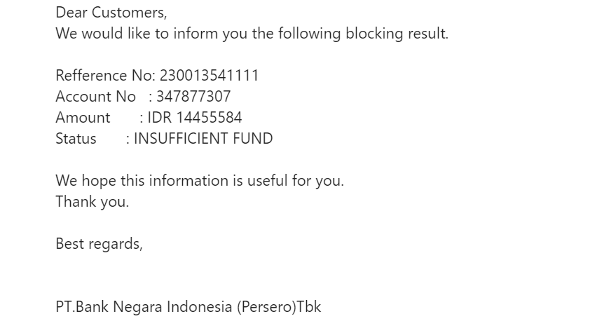
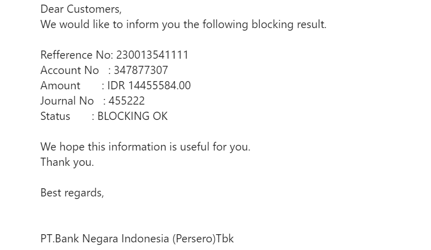

# Update Hold BNI

Pada saat verifikator ke 2 (Port Manager / Satker) melakukan verifikasi maka Sistem `CMS` akan melakukan pengiriman Request `Update Hold` ke `Bank BNI`.

## Dana Tidak Mencukupi

Pada Menu `Berthing List` perhatikan dibagian kolom `Bank Status` = `Waiting` dan `Status` = `Verified`, kemudian adanya notifikasi E-mail dari `Bank BNI` statusnya `Insufficinet Fund` seperti dibawah ini :



Dari notifikasi E-mail diatas menunjukkan bahwa proses `Update Hold` Agent / PBM mengalami kegagalan dikarenakan dana yang tidak mencukupi. Pada kasus ini harus dibuat file request `Update Hold` secara manual dan ada beberapa step-step yang harus dilakukan antara lain :

### Step 1

Hubungi `Team MTO` untuk menginformasikan ke Agent / PBM bahwa proses `Update Hold` dana mengalami kegagalan karena dana tidak mencukupi.

### Step 2

`Pastikan` bahwa Agent / PBM sudah melakukan Top Up dana terlebih dahulu, jika sudah dipastikan maka bisa dilanjutkan ke [Step 3](update-hold-bni.md#step-3).

### Step 3

Pergi ke direktori `/var/www/cms.scnport.com/public_html/bni/update`, kemudian buat file text `(.txt)` secara manual sesuai dengan mengacu format standar penamaan file dan susunan data request `Update Hold`. Untuk standar format penamaan file adalah sebagai berikut :

- YYYYMMDDhhmmss_RequestUpdateHold.txt

Untuk membuat file secara manual bisa menjalankan perintah dibawah ini :

```bash
touch YYYYMMDDhhmmss_RequestUpdateHold.txt
```

!> sesuaikan standar format penamaan dengan waktu sekarang, pada contoh kasus ini adalah `20231020144960_RequestUpdateHold.txt`

### Step 4

Jika secara manual membuat file sudah berhasil maka bisa dilanjutkan dengan manambah isi pada file tersebut, untuk standar format pengisian file adalah sebagai berikut :

- UPDATE HOLD|REK-NO|REK-NAMA|NOMINAL-LAMA|NOMINAL-BARU|PUK-12|JOURNAL-NO|REMARK|SCN Port|end
  - `REK-NO` adalah nomor rekening Agent / PBM, datanya bisa dicek di Aplikasi `CMS` / di tabel database.
  - `REK-NAMA` adalah nama rekening Agent / PBM, datanya bisa dicek di Aplikasi `CMS` / di tabel database.
  - `NOMINAL-LAMA` adalah nominal dana `Hold` yang lama, datanya bisa dicek di [Log Aktifitas](log-aktifitas.md).
  - `NOMINAL-Baru` adalah nominal dana `Update Hold` yang baru, datanya bisa dicek di Aplikasi `CMS` / di [Log Aktifitas](log-aktifitas.md).
  - `PUK-12` adalah data gabungan antara `NO. PUK` dan `3 digit unik sesuai request`, datanya bisa dicek di Aplikasi `CMS` / di [Log Aktifitas](log-aktifitas.md).
  - `JOURNAL-NO` adalah data `Journal No`, datanya bisa dicek di E-mail Notifikasi host `BNI` / di Aplikasi `CMS` atau di [Log Aktifitas](log-aktifitas.md).
  - `REMARK` adalah data catatan perintah / dihapus.

contoh perubahan format sebagai berikut :

```text
UPDATE HOLD|4007707999|PT. DINAMIKAABADI|268992|1553856|220023076101|289614||SCN Port|end
```

Untuk mengisi file bisa menjalankan perintah dibawah ini :

```bash
nano [target].txt
```

!> ubah `[target]` dengan file yang sudah berhasil dibuat secara manual sebelumnya, pada contoh kasus ini adalah `20231020144960_RequestUpdateHold.txt`

### Step 5

`Enkripsi` file yang sebelumnya sudah diisi dengan menggunakan comman dibawah ini :

```bash
gpg -o [target].txt --encrypt --recipient paruhum.aritonang@bni.co.id [result].gpg
```

!> Ubah `[target]` dan `[result]` dengan standar format sebelumnya, dalam contoh kasus ini adalah `20231020144960_RequestUpdateHold`

### Step 6

Jika proses `Enkripsi` sudah berhasil, maka dilanjutkan dengan menyalin file hasil `Enkripsi` tersebut ke direktori `outgoing` dengan menggunakan perintah dibawah ini :

```bash
cp [target].gpg /var/www/cms.scnport.com/public_html/bni/update/outgoing
```

!> Ubah `[target]` nama file hasil enkripsi sebelumnya, dalam contoh kasus ini adalah `20231020144960_RequestUpdateHold`

### Step 7

Setelah [Step 6](update-hold-bni.md#step-6) sudah berhasil, kurang dari 15 menit maka file request akan diambil dan dihapus oleh `Host Bank BNI`.
Jika lebih dari 15 Menit file request tersebut masih ada maka bisa dipastikan ada masalah pengambilan file request, bisa dilihat pada [File Request Masih Ada di Outgoing](update-hold-bni.md#file-request-masih-ada-di-outgoing)

### Step 8

Jika setelah 15 Menit dan file request yang di direktori `Outgoing` sudah tidak ada, maka berarti `Host Bank BNI` sudah mengambil dan menghapus file request tersebut. Kemudian menunggu maksimal 15 menit, `Host Bank BNI` akan mengirimkan file balikan ke direktori `incoming` atau `/var/www/cms.scnport.com/public_html/bni/update/incoming`.

### Step 9

Secara paralel sambil menunggu file balikan bisa dilakukan pengecekan apakah ada notifikasi E-mail dari `Bank BNI`.
Setelah 15 menit menunggu file balikan dari `Host Bank BNI`, ada beberapa kasus yang bisa terjadi antara lain :

- Di direktori `incoming` masih belum ada balikan yang dikirim oleh `Host Bank BNI`, selanjutnya bisa dilihat [File Balikan Tidak Ada Di Incoming](update-hold-bni.md#file-balikan-tidak-ada-di-incoming).

- Di direktori sudah ada file balikan akan tetapi `Sistem CMS` tidak bisa membaca file balikan tersebut dikarenakan format tidak sesuai standar, sedangkan sudah ada E-mail notifikasi dari host `BNI` yang meninformasikan bahwa proses `Update Hold` Agent / PBM sukses. Pada kasus ini maka harus dilakukan update secara manual, bisa dilihat [Update Status Hold (Manual)](hold-bni.md#update-status-hold-manual).

- Di direktori sudah ada file balikan oleh `Host Bank BNI` dan `Sistem CMS` bisa membaca format file balikan, jika balikan tersebut meninformasikan bahwa `Update Hold` dana sukses maka `Sistem CMS` akan secara otomatis mengupdate data `(tabel uper_detail dan lain-lainnya)`, kemudian pada tampilan `Berthing List` perhatikan kolom `Bank Status` akan berubah menjadi `Update Hold` dan kolom `Status` akan berubah menjadi `Uper Hold`.

### Step 10

Selesai.

## File Request Masih Ada Di Outgoing

File request yang ada di direktori `outgoing` masih ada setelah menunggu 15 menit, bisa disebabkan ada masalah jaringan atau kemungkinan ada penyebab lain.

Untuk pengecekkan masalah bisa dilakukan beberapa step-step dibawah ini:

### Step 1

Periksa koneksi antara host `CMS` ke host `BNI` dengan menggunakan IP `182.16.167.165`, bisa dilakukan `ping` terhadap IP tersebut dengan perintah dibawah ini:

```bash
ping 182.16.167.165
```

### Step 2

Jika gagal `ping` host `BNI`, periksa lebih lanjut masalah koneksinya.

- Pastikan host `CMS` dapat ping ke host lain di LAN /Internet.

  - Jika gagal, berarti host `CMS` bermasalah koneksi jaringannya. Segera informasikan ke Team IT lain terkait adanya koneksi jaringan pada host `CMS`.
  - Jika berhasil, berarti host `BNI` bermasalah dan segera hubungi pihak `BNI` melalui E-mail `tbs_sat@bni.co.id`. Informasikan kepada mereka bahwa host `BNI` IP `182.16.167.165` tidak dapat di-`ping` atau tidak dapat dihubungi oleh `CMS`.

### Step 3

Jika berhasil `ping` host `BNI`, berarti penyebab masalah adalah host `BNI` tidak mengambil file. Reguler otomatis `Web DAV` untuk cek ke direktori `/var/www/cms.scnport.com/public_html/bni/update/outgoing/` tidak berjalan. Normalnya, setiap 15 menit host `BNI` akan memeriksa/cek file di direktori `outgoing`.

Segera hubungi pihak `BNI` melalui E-mail `tbs_sat@bni.co.id`, dengan menyertakan bukti `Log` yang menunjukkan kapan host `BNI` terakhir mengunjungi/mengecek ke host `CMS`. Ini dapat dilihat di `Log Server` pada direktori `var/log/apache2/cms.scnport.com`, atau dengan perintah di bawah ini :

```bash
cat access.log | grep '182.16.167.165'
```

### Step 4

Setelah pihak `BNI` dihubungi, langkah selanjutnya `IT` adalah menunggu respon / reply komunikasi dari mereka.

Secara paralel, periksa direktori `/var/www/cms.scnport.com/public_html/bni/update/outgoing` dan `/var/www/cms.scnport.com/public_html/bni/update/incoming`. Jika folder outgoing telah kosong, berarti file Perintah telah dibaca oleh host `BNI` dan `CMS` tinggal menunggu file balikan yang diletakan di direktori incoming oleh host `BNI`.

### Step 5

Selesai.

## File Balikan Tidak Ada Di Incoming

Setelah host `BNI` berhasil mengambil dan menghapus file request di direktori `outgoing`, selanjutnya maksimal 15 menit host `BNI` akan mengirim file balikan di direktori `incoming`. Apabila tidak ada file balikan dari host `BNI` pada direktori `incoming` maka bisa dipastikan ada kemungkinan host `BNI` tidak mengirim balikan atau `CMS` tidak menerima file balikan.

Lakukan cek notifikasi E-mail dari host `BNI` sebagai berikut :

- Jika E-mail host `BNI` seperti gambar dibawah ini maka bisa dipastikan bahwa proses `Update Hold` Agent / PBM gagal karena dana tidak mencukupi, bisa dilihat [Dana Tidak Mencukupi](update-hold-bni.md#dana-tidak-mencukupi).


- Jika E-mail host `BNI` seperti gambar dibawah ini maka bisa dipastikan bahwa proses `Udpate Hold` Agent / PBM berhasil, akan tetapi `Sistem CMS` tidak bisa merubah status secara otomatis dikarenakan tidak adanya file balikan dati host `BNI`, untuk itu harus dilakukan update data secara manual, bisa dilihat [Update Status Hold (Manual)](hold-bni.md#update-status-hold-manual).


